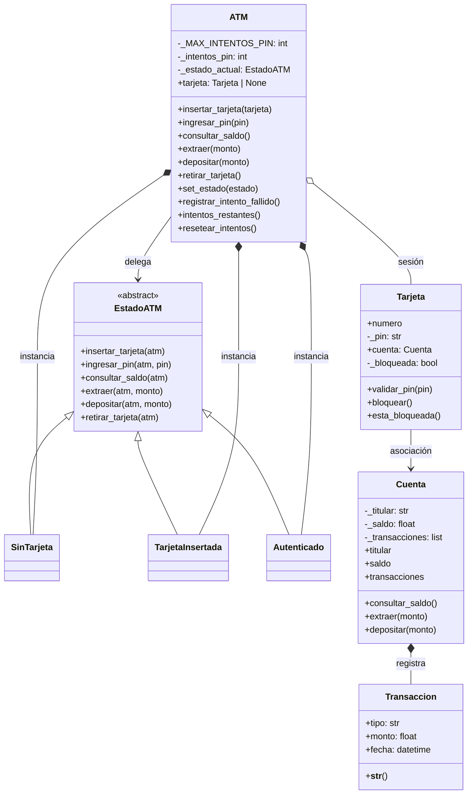

# Documento UML

## Lenguaje utilizado

El diagrama de clases está escrito en **Mermaid**, un lenguaje textual que se puede incrustar en Markdown. Esto permite mantener el UML versionado junto al código fuente y actualizarlo con facilidad.

## Diagrama de clases

## Relación entre clases

| Clase | Responsabilidad | Relación principal |
|---|---|---|
| `ATM` | Coordina la sesión y delega acciones al estado actual | Usa el patrón State |
| `EstadoATM` | Define la interfaz común de los estados | Abstracción |
| `SinTarjeta`, `TarjetaInsertada`, `Autenticado` | Implementan comportamientos distintos según el estado | Herencia y polimorfismo |
| `Tarjeta` | Representa la tarjeta y su validación de PIN | Asociación con `Cuenta` |
| `Cuenta` | Administra saldo y movimientos | Composición con `Transaccion` |
| `Transaccion` | Guarda el detalle de cada operación | Registro histórico |

## Dónde se aplican los conceptos de POO

### Encapsulamiento

- `Cuenta` oculta `_saldo`, `_titular` y `_transacciones`.
- `Tarjeta` oculta `_pin` y `_bloqueada`.
- `ATM` oculta `_estado_actual` y `_intentos_pin`.

### Abstracción

- `states/estado_atm.py` define `EstadoATM` como clase abstracta.
- La clase marca las operaciones que todo estado debe implementar.

### Herencia

- `SinTarjeta`, `TarjetaInsertada` y `Autenticado` heredan de `EstadoATM`.

### Polimorfismo

- `ATM` llama siempre los mismos métodos (`consultar_saldo`, `extraer`, `depositar`, etc.).
- El resultado cambia según el estado concreto que esté activo.

## Patrón de diseño

### State

El comportamiento del cajero cambia según el estado actual de la sesión:

- `SinTarjeta`: bloquea todas las operaciones salvo insertar tarjeta.
- `TarjetaInsertada`: permite validar el PIN.
- `Autenticado`: habilita saldo, extracción y depósito.

Esto evita usar cadenas largas de `if` y permite agregar estados nuevos con bajo impacto sobre `ATM`.

## Relación entre objetos

### Asociación

- `Tarjeta` tiene una referencia a `Cuenta`.

### Composición

- `Cuenta` mantiene una colección de `Transaccion`.

## Observación para la defensa

El modelo cumple con la consigna porque presenta más de tres clases principales, relaciones claras entre objetos y un patrón de diseño funcional que puede mostrarse en ejecución desde `main.py`.
